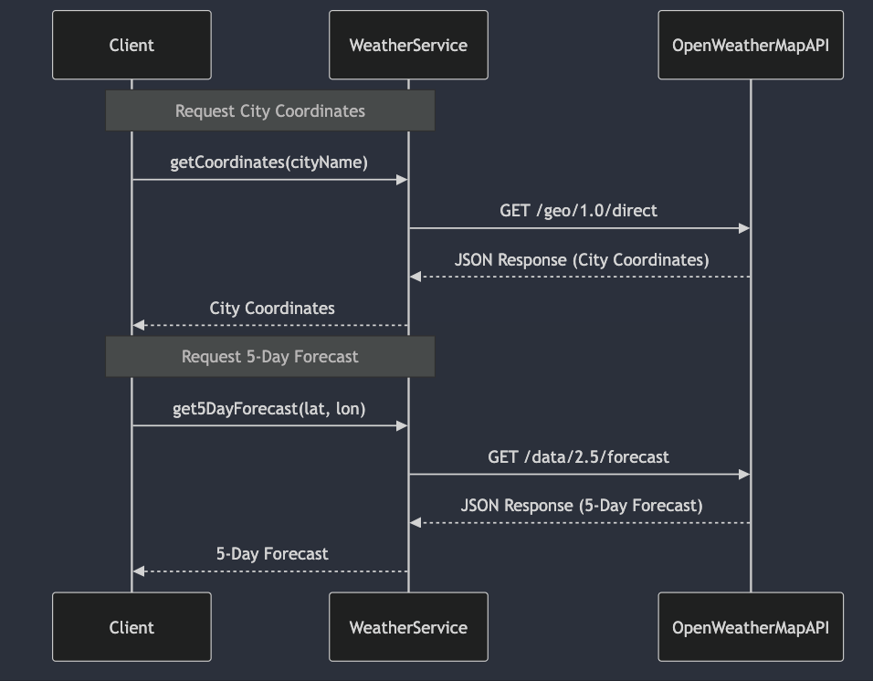

# Weather Microservice Communication Contract
This README provides the communication contract outlining the API endpoints and data formats for interacting with the weather microservice, providing city coordinates and 5-day weather forecasts.

# Requesting Data from the Microservice using REST API:
To request data from the WeatherService, you can use the following HTTP GET requests. You need to call the API with the city name to retrieve the weather information.

## Get Current Weather:

Endpoint: (https://api.openweathermap.org/data/2.5/weather)
Method: GET
Parameters: 
    city: Name of the city.
Example Call:
```python
import requests

city_name = "Seattle"
response = requests.get(f"http://127.0.0.1:5000/get-coordinates?city={city_name}")

if response.status_code == 200:
    data = response.json()
    print(data)
else:
    print(f"Failed to retrieve data: {response.status_code}")
```

## Get 5-Day Weather Forecast:

Endpoint: /forecast
Method: GET
Parameters:
    lat: Latitude.
    lon: Longitude.
Example Call:
```python 
import requests

lat = 47.6067
lon = -122.3321
response = requests.get(f"http://127.0.0.1:5000/5-day-forecast?lat={lat}&lon={lon}")

if response.status_code == 200:
    forecast = response.json()
    print(forecast)
else:
    print(f"Failed to retrieve data: {response.status_code}")
```
# Receiving Data from the Microservice:

Responses are in JSON format. 

## Receive City Coordinates
```python
{
  "latitude": 47.6067,
  "longitude": -122.3321
}
```

## Receive 5-Day Weather Forecast 
```python

[
  {
    "dt": 1697635200,
    "temp": 14.0,
    "weather": "clear sky",
    "wind": 4.1,
    "main": {
      "temp": 14.0,
      "humidity": 82
    }
  },
  {
    "dt": 1697721600,
    "temp": 16.0,
    "weather": "few clouds",
    "wind": 4.1,
    "main": {
      "temp": 16.0,
      "humidity": 80
    }
  }
]
```

# UML Sequence Diagram


